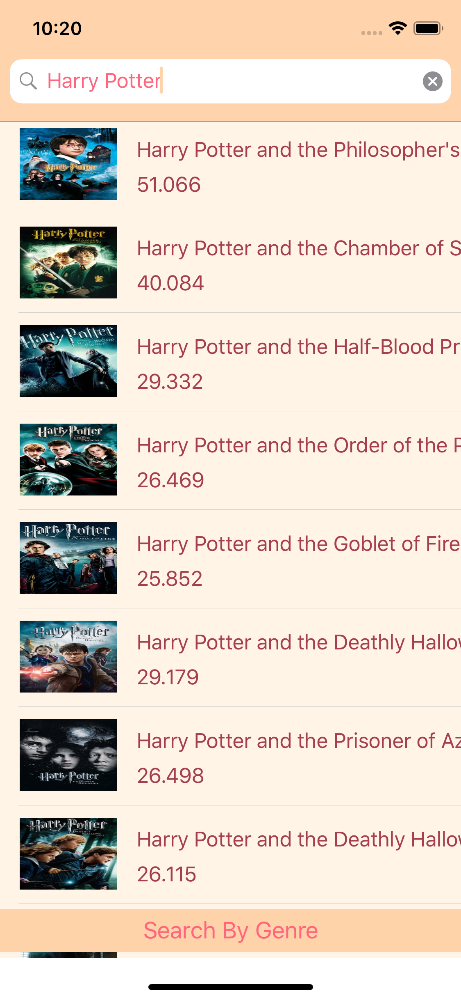
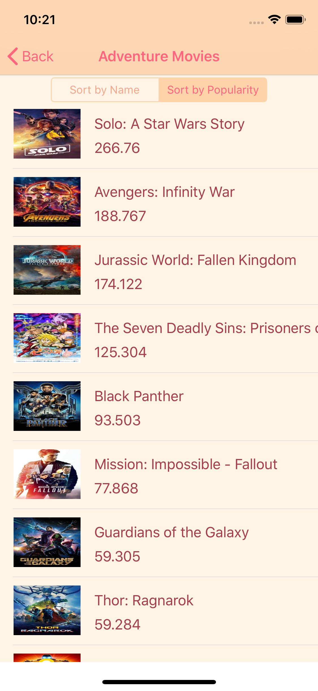
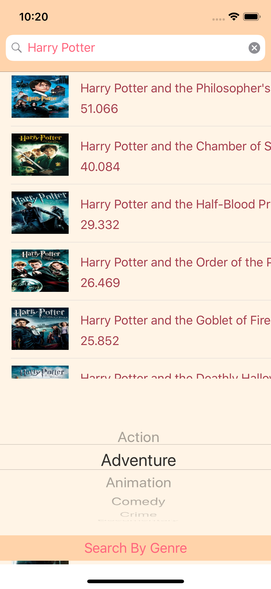
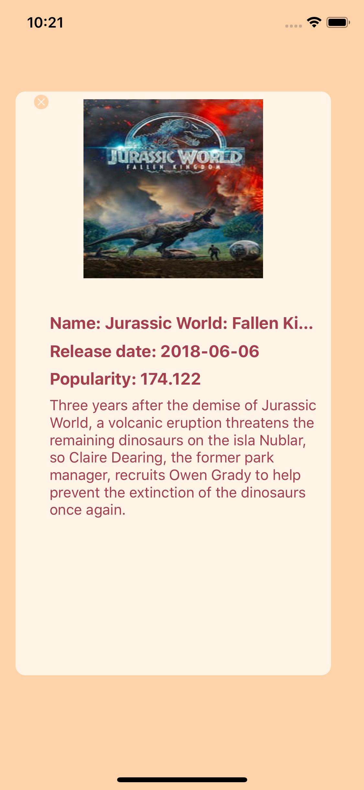

# Movie-Search
This iOS project gets movie data from [The Movie Database](https://www.themoviedb.org/documentation/api) and shows them properly in **UITableView**. 

**UISearchBar** and **UIPickerView** were used in order to make a movie searchable by typing name or choosing genre of the movie. 
And also **UISegmentedControl** was used to make it has a changeable sorting system.

# ScreenShots

 

 

 

 

